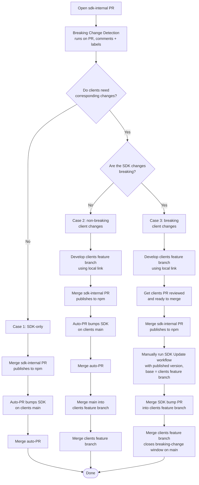
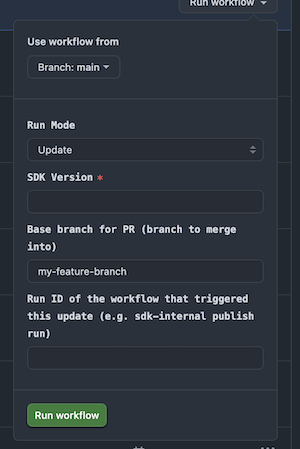

# Bitwarden Internal SDK

This repository houses the internal Bitwarden SDKs. We also provide a public
[Secrets Manager SDK](https://github.com/bitwarden/sdk-sm).

> [!WARNING]
>
> The password manager SDK is not intended for public use and is not supported by Bitwarden at this
> stage. It is solely intended to centralize the business logic and to provide a single source of
> truth for the internal applications. As the SDK evolves into a more stable and feature-complete
> state we will re-evaluate the possibility of publishing stable bindings for the public. **The
> password manager interface is unstable and will change without warning.**

## Crates

The project is structured as a monorepo using cargo workspaces. Some of the more noteworthy crates
are:

- [`bitwarden-api-api`](./crates/bitwarden-api-api): Auto-generated API bindings for the API server.
- [`bitwarden-api-identity`](./crates/bitwarden-api-identity): Auto-generated API bindings for the
  Identity server.
- [`bitwarden-core`](./crates/bitwarden-core): The core functionality consumed by the other crates.
- [`bitwarden-crypto`](./crates/bitwarden-crypto): Crypto library.
- [`bitwarden-wasm-internal`](./crates/bitwarden-wasm-internal): WASM bindings for the internal SDK.
- [`bitwarden-uniffi`](./crates/bitwarden-uniffi): Mobile bindings for swift and kotlin using
  [UniFFI](https://github.com/mozilla/uniffi-rs/).

## Requirements

- [Rust](https://www.rust-lang.org/tools/install) latest stable version - (preferably installed via
  [rustup](https://rustup.rs/)).
- NodeJS and NPM.

## Setup instructions

1.  Clone the repository:

    ```bash
    git clone https://github.com/bitwarden/sdk-internal.git
    cd sdk-internal
    ```

2.  Install the dependencies:

    ```bash
    npm ci
    ```

## Building

Run the following command:

```bash
cargo build
```

### Special considerations for Windows on ARM

For Windows on ARM, you will need the following in your `PATH`:

- [Python](https://www.python.org)
- [Clang](https://clang.llvm.org)
  - We recommend installing this via the
    [Visual Studio Build Tools](https://visualstudio.microsoft.com/downloads/#build-tools-for-visual-studio-2022)

## Integrating builds into client applications for local development

Integrating the SDK into client applications for local development requires two steps:

1. Building `sdk-internal` with bindings specific to the client application, and
2. Linking the build with your client for consumption there.

The instructions are different depending on the client that will be consuming the SDK.

> [!NOTE]
>
> These instructions assume a directory structure similar to:
>
> ```text
> sdk-internal/
> clients/
> ios/
> android/
> ```
>
> If your repository directory structure differs you will need to adjust the commands accordingly.

### Web clients

#### Building

Build the SDK to expose WASM bindings, which will be consumed by our web clients, by following the
instructions in
[`crates/bitwarden-wasm-internal`](https://github.com/bitwarden/sdk-internal/tree/main/crates/bitwarden-wasm-internal).

After completing these instructions, you'll have built an SDK artifact that includes either
OSS-licensed code, or both OSS- and commercially-licensed code, based on your choice of build
script. See [Licensing](#licensing) for details on why we have multiple packages and determine which
one(s) you need to build.

#### Linking

The web clients use NPM to install `sdk-internal` as a dependency. NPM offers a dedicated command
[`link`][npm-link] which can be used to temporarily replace the packages with a locally-built
version.

When building the web `sdk-internal` artifacts, you had the option to build the OSS or the
commercially-licensed version. You will need to adjust your `npm link` command according to which
one you built, and which one you intend to make available to the client application for your local
development.

| Desired client build           | Build script you ran          | SDK artifact built                                        | Link command                                                                                                                       | Result                                                               |
| ------------------------------ | ----------------------------- | --------------------------------------------------------- | ---------------------------------------------------------------------------------------------------------------------------------- | -------------------------------------------------------------------- |
| OSS                            | `./build.sh`                  | Artifact with OSS-licensed code                           | `npm link ../sdk-internal/crates/bitwarden-wasm-internal/npm`                                                                      | SDK with OSS-licensed code linked to `clients`                       |
| Commercial (Bitwarden license) | `./build.sh && ./build.sh -b` | Artifact with **both** OSS and commercially-licensed code | `npm link ../sdk-internal/crates/bitwarden-wasm-internal/npm ../sdk-internal/crates/bitwarden-wasm-internal/bitwarden_license/npm` | SDK with both OSS and commercially-licensed code linked to `clients` |

Running `npm link` will restore any previously linked packages, so only the paths in the last run
command will be linked. When doing commercial development, always link **both** packages (as shown
above) so that changes to OSS types are also reflected in the client — linking only the
commercially-licensed package will leave OSS types stale.

> [!WARNING]
>
> Running `npm ci` or `npm install` will replace the linked packages with the published version.

### Android

#### Building

Build the SDK to expose Kotlin bindings through UniFFI, which will be consumed by our Android mobile
app. Follow the instructions in
[`crates/bitwarden-uniffi/kotlin`](https://github.com/bitwarden/sdk-internal/tree/main/crates/bitwarden-uniffi/kotlin).

#### Linking

1. Build and publish the SDK to the local Maven repository:

   ```bash
   ../sdk-internal/crates/bitwarden-uniffi/kotlin/publish-local.sh
   ```

2. Set the user property `localSdk=true` in the `user.properties` file.

### iOS

#### Building

Build the SDK to expose iOS bindings through UniFFI, which will be consumed by our iOS mobile app.
Follow the instructions in
[`crates/bitwarden-uniffi/swift`](https://github.com/bitwarden/sdk-internal/tree/main/crates/bitwarden-uniffi/swift).

#### Linking

Run the bootstrap script with the `LOCAL_SDK` environment variable set to true in order to use the
local SDK build:

```bash
LOCAL_SDK=true ./Scripts/bootstrap.sh
```

## Integrating into clients from published artifacts

In addition to
[linking to local builds](#integrating-builds-into-client-applications-for-local-development) during
development, you will need to be able to integrate your `sdk-internal` changes into published
artifacts, so that the client applications can be tested and published with the requisite SDK
changes included.

The process for doing so varies based on the client, as the method by which the `sdk-internal`
package is consumed differs.

> [!WARNING]
>
> **BREAKING CHANGES** When a pull request is opened to merge changes from `sdk-internal` into
> `main`, a [Breaking Change Detection ](./.github/workflows/detect-breaking-changes.yml) workflow
> will run and comment on the PR if breaking changes are detected on any clients. If your PR
> includes breaking changes **you must be prepared to address them as soon as they merge with a
> corresponding PR in the client application repository**. If not, any subsequent `sdk-internal`
> integrations into clients will be blocked, as those other teams will not know how best to resolve
> the breaking API contracts that you introduced.

### Web clients

For our web clients, the `sdk-internal` packages for our OSS- and commercially-licensed SDK versions
with their WebAssembly bindings are published to npm at:

- https://www.npmjs.com/package/@bitwarden/sdk-internal and
- https://www.npmjs.com/package/@bitwarden/commercial-sdk-internal

These npm packages are referenced as
[dependencies](https://github.com/bitwarden/clients/blob/main/package.json) in our `clients` repo.
See [Licensing](#licensing) for details on why we have multiple packages.

Every commit to `main` in `sdk-internal` will trigger a
[publish](https://github.com/bitwarden/deploy/blob/main/.github/workflows/publish-wasm-internal.yml)
(internal access only) of these packages, with versions structured as follows:

```
{SemanticVersion}-main.{actionRunNumber}
```

For example:

```
0.1.0-main.470
```

> [!TIP]
>
> <a id="finding-the-published-sdk-version"></a>**Finding the published SDK version.** After your
> `sdk-internal` PR merges, find the version that was published as follows:
>
> 1. Open the
>    [publish workflow](https://github.com/bitwarden/deploy/actions/workflows/publish-wasm-internal.yml)
>    in the `deploy` repo (internal access only).
> 2. Find the workflow run whose commit SHA matches the merge commit of your `sdk-internal` PR (the
>    run title includes the commit message).
> 3. Open that run and read the **Summary** tab. The published version is printed there in the
>    `{SemanticVersion}-main.{actionRunNumber}` format shown above (for example, `0.1.0-main.470`).
>
> Copy that value verbatim — it is what you supply to `npm install`, to the `clients` "SDK Update"
> workflow, or to any other consumer that needs to pin to your build.

#### Choosing the right integration path

The process for getting your `sdk-internal` changes into `clients` depends on two questions:

1. Does the `clients` repo need corresponding changes to consume the new SDK version?
2. Are the SDK changes breaking?

This produces three cases (a breaking change necessarily requires a corresponding client change, so
the fourth case isn't considered):

| Case | Client changes needed? | Breaking? | Coordination                                           |
| ---- | ---------------------- | --------- | ------------------------------------------------------ |
| 1    | No                     | No        | None, fully automated                                  |
| 2    | Yes                    | No        | Order-independent, can be done at the developer's pace |
| 3    | Yes                    | Yes       | Tight coordinationn required across the two repos      |

The end-to-end flow, from opening an `sdk-internal` PR through merging into `clients`, looks like
this:



#### Case 1: SDK changes without corresponding client changes

No action is required in `clients` other than updating the `sdk-internal` dependency.

1. Merge the `sdk-internal` pull request. This triggers a publish of the new version to npm.
2. An
   [automated PR](https://github.com/bitwarden/clients/tree/main/.github/workflows/sdk-update.yml)
   opens (or updates) in `clients` bumping the SDK dependency on `main`.
3. Merge that PR to bring your SDK changes into `clients` `main`.

#### Case 2: SDK changes with non-breaking client changes

Because the change is non-breaking, `clients` `main` remains buildable at every point regardless of
the order in which the SDK and client PRs merge.

1. Develop the corresponding `clients` changes on a feature branch, using
   [local linking](#integrating-builds-into-client-applications-for-local-development) to build
   against your in-progress SDK.
2. Merge the `sdk-internal` pull request. This triggers a publish of the new version to npm and the
   creation or update of an
   [automated PR](https://github.com/bitwarden/clients/tree/main/.github/workflows/sdk-update.yml)
   bumping the SDK dependency on `clients` `main`.
3. Merge that automated PR to bring the new SDK version into `main`.
4. Merge `main` into your `clients` feature branch to pick up the new SDK version, then merge your
   feature branch through the normal review process.

#### Case 3: SDK changes with breaking client changes

This is the only case that requires coordination across the two repos. Once the SDK breaking change
merges to `main` and publishes, `clients` `main` cannot compile against the new version until the
consuming client PR has merged. Your job is to keep that window as short as possible.

**You must have a corresponding `clients` PR ready to merge before you merge the SDK PR.** If not,
any subsequent `sdk-internal` integrations into `clients` will be blocked, as other teams will not
know how to resolve the breaking API contracts you introduced.

Recommended sequence:

1. Develop the `clients` feature branch against the in-progress SDK using
   [local linking](#integrating-builds-into-client-applications-for-local-development), and get it
   reviewed and approved so it is ready to merge.
2. Merge the `sdk-internal` pull request. This triggers a publish of the new version to npm.
3. On the `clients` repo, trigger a manual workflow run of the "SDK Update" action against your
   feature branch. This bumps the SDK dependency on your feature branch so CI compiles against the
   published breaking change.

   **Enter the sdk-internal version** to the version published in step 2 (see
   [Finding the published SDK version](#finding-the-published-sdk-version)), and **Enter your
   `clients` feature branch** as the base for your PR:

   

4. Merge the client feature branch to close the breaking-change window on `main`.

### Mobile clients

The iOS and Android applications use an automated, reactive approach to integrating `sdk-internal`
changes into their repositories.

When you need to integrate `sdk-internal` changes into the iOS or Android applications, you should
use the automatically-generated pull requests for each repository:

| Client  | SDK workflow                                                                            | Client workflow                                                            |
| ------- | --------------------------------------------------------------------------------------- | -------------------------------------------------------------------------- |
| Android | https://github.com/bitwarden/sdk-internal/blob/main/.github/workflows/build-android.yml | https://github.com/bitwarden/android/actions/workflows/sdlc-sdk-update.yml |
| iOS     | https://github.com/bitwarden/sdk-internal/blob/main/.github/workflows/build-swift.yml   | https://github.com/bitwarden/ios/actions/workflows/sdlc-sdk-update.yml     |

## Server API Bindings

We auto-generate the server bindings using
[openapi-generator](https://github.com/OpenAPITools/openapi-generator), which creates Rust bindings
from the server OpenAPI specifications. These bindings are
[regularly updated](https://github.com/bitwarden/sdk-internal/actions/workflows/update-api-bindings.yml)
to ensure they stay in sync with the server.

The bindings are exposed as multiple crates, one for each backend service:

- [`bitwarden-api-api`](./crates/bitwarden-api-api/README.md): For the `Api` service that contains
  most of the server side functionality.
- [`bitwarden-api-identity`](./crates/bitwarden-api-identity/README.md): For the `Identity` service
  that is used for authentication.

When performing any API calls the goal is to use the generated bindings as much as possible. This
ensures any changes to the server are accurately reflected in the SDK. The generated bindings are
stateless, and always expects to be provided a `Configuration` instance. The SDK exposes these under
the `get_api_configurations` function on the `Client` struct.

You should not expose the request and response models of the auto-generated bindings and should
instead define and use your own models. This ensures the server request / response models are
decoupled from the SDK models and allows for easier changes in the future without breaking backwards
compatibility.

We recommend using either the `From` or `TryFrom` conversion traits depending on if the conversion
requires error handling or not. Below are two examples of how this can be done:

```rust
# use bitwarden_crypto::EncString;
# use serde::{Serialize, Deserialize};
# use serde_repr::{Serialize_repr, Deserialize_repr};
#
# #[derive(Serialize, Deserialize, Debug, Clone)]
# struct LoginUri {
#     pub uri: Option<EncString>,
#     pub r#match: Option<UriMatchType>,
#     pub uri_checksum: Option<EncString>,
# }
#
# #[derive(Clone, Copy, Serialize_repr, Deserialize_repr, Debug, PartialEq)]
# #[repr(u8)]
# pub enum UriMatchType {
#     Domain = 0,
#     Host = 1,
#     StartsWith = 2,
#     Exact = 3,
#     RegularExpression = 4,
#     Never = 5,
# }
#
# #[derive(Debug)]
# struct VaultParseError;
#
impl TryFrom<bitwarden_api_api::models::CipherLoginUriModel> for LoginUri {
    type Error = VaultParseError;

    fn try_from(uri: bitwarden_api_api::models::CipherLoginUriModel) -> Result<Self, Self::Error> {
        Ok(Self {
            uri: EncString::try_from_optional(uri.uri)
                .map_err(|_| VaultParseError)?,
            r#match: uri.r#match.map(|m| m.into()),
            uri_checksum: EncString::try_from_optional(uri.uri_checksum)
                .map_err(|_| VaultParseError)?,
        })
    }
}

impl From<bitwarden_api_api::models::UriMatchType> for UriMatchType {
    fn from(value: bitwarden_api_api::models::UriMatchType) -> Self {
        match value {
            bitwarden_api_api::models::UriMatchType::Domain => Self::Domain,
            bitwarden_api_api::models::UriMatchType::Host => Self::Host,
            bitwarden_api_api::models::UriMatchType::StartsWith => Self::StartsWith,
            bitwarden_api_api::models::UriMatchType::Exact => Self::Exact,
            bitwarden_api_api::models::UriMatchType::RegularExpression => Self::RegularExpression,
            bitwarden_api_api::models::UriMatchType::Never => Self::Never,
        }
    }
}
```

### Updating bindings after a server API change

When the API exposed by the server changes, new bindings will need to be generated to reflect this
change for consumption in the SDK. Examples of such changes include adding new fields to server
request / response models, removing fields from models, or changing types of models.

A GitHub workflow exists to
[update the API bindings](https://github.com/bitwarden/sdk-internal/actions/workflows/update-api-bindings.yml).
This workflow should always be used to merge any binding changes to `main`, to ensure that there are
not conflicts with the auto-generated bindings in the future. Binding changes should **not** be
included as a part of the PR to consume them.

There are two ways to run the workflow:

1. Manually run the `Update API Bindings`
   [workflow](https://github.com/bitwarden/sdk-internal/actions/workflows/update-api-bindings.yml)
   in the `sdk-internal` repo. You can choose whether to update the bindings for the API, Identity,
   or both. You will likely only need to update the API bindings for the majority of changes.

2. Wait for an automatic binding update to run, which is scheduled every 2 weeks. This update will
   generate bindings for both API and Identity and create two PRs.

A suggested workflow for incorporating server API changes into the SDK would be:

1. Make changes in `server` repo to expose the new API.
2. Merge `server` changes to `main`.
3. Trigger the `Update API Bindings` workflow in `sdk-internal` to open a pull request with the
   updated API bindings.
4. Review and merge that pull request to `sdk-internal` `main` branch.
5. Pull in `sdk-internal` `main` into your feature branch for SDK work.
6. Consume new API models in SDK code.

#### Local binding updates

> [!IMPORTANT]
>
> Use the [workflow](#updating-bindings-after-a-server-api-change) to make any merged binding
> changes. Running the scripts below can be helpful during local development, but please ensure that
> any changes to the bindings in `bitwarden-api-api` and `bitwarden-api-identity` are **not**
> checked into any pull request.

In order to update the bindings locally, we first need to build the internal Swagger documentation.
This code should not be directly modified. Instead use the instructions below to generate Swagger
documents and use these to generate the OpenApi bindings.

#### Swagger generation

The first step is to generate the Swagger documents from the root of the
[server repository](https://github.com/bitwarden/server).

```bash
pwsh ./dev/generate_openapi_files.ps1
```

#### OpenApi Generator

To generate a new version of the bindings, run the following script from the root of the SDK
project. This requires a Java Runtime Environment, and also assumes the repositories `server` and
`sdk-internal` have the same parent directory.

```bash
./support/build-api.sh
```

This project uses customized templates that live in the `support/openapi-template` directory. These
templates resolve some outstanding issues we've experienced with the Rust generator. But we strive
towards modifying the templates as little as possible to ease future upgrades.

> [!NOTE]
>
> If you don't have the nightly toolchain installed, the `build-api.sh` script will install it for
> you.

## Licensing

The Bitwarden internal SDK includes both OSS- and commercially-licensed code. This allows shared
code to exist in our SDK to support commercially-licensed (also known as Bitwarden-licensed)
clients.

The OSS-licensed packages that are published from `sdk-internal` include only code licensed under
the [GPL](./LICENSE_GPL.txt) license. The commercially-licensed packages that are published from
`sdk-internal` include the OSS-licensed code, as well as code that is licensed under our
[commercial](./LICENSE_SDK.txt) license.

If you are developing in a client that needs both licensing models, you should be aware of the two
and ensure that they are both updated when integrating new SDK changes into the client application.

## Developer tools

This project recommends the use of certain developer tools and includes configurations for them to
make developers' lives easier. The use of these tools is optional, and they might require a separate
installation step.

The list of developer tools is:

- `Visual Studio Code`: We provide a recommended extension list which should show under the
  `Extensions` tab when opening this project with the editor. We also offer a few launch settings
  and tasks to build and run the SDK
- `bacon`: This is a CLI background code checker. We provide a configuration file with some of the
  most common tasks to run (`check`, `clippy`, `test`, `doc` - run `bacon -l` to see them all). This
  tool needs to be installed separately by running `cargo install bacon --locked`.
- `nexttest`: This is a new and faster test runner, capable of running tests in parallel and with a
  much nicer output compared to `cargo test`. This tool needs to be installed separately by running
  `cargo install cargo-nextest --locked`. It can be manually run using
  `cargo nextest run --all-features`

## Formatting & Linting

This repository uses various tools to check formatting and linting before it's merged. It's
recommended to run the checks before submitting a PR.

### Running the checks

```
npm run lint           # run every check (check-only, matches CI)
npm run lint:fix       # auto-fix where supported, then run the rest

# Run a single check:
npm run lint -- --only fmt
npm run lint -- --only clippy
```

The list of available checks: `fmt`, `clippy`, `sort`, `udeps`, `dylint`, `doc`, `prettier`,
`dep-ownership`, `cargo-lock`.

The command is implemented in [scripts/lint.sh](./scripts/lint.sh) and mirrors
[.github/workflows/lint.yml](./.github/workflows/lint.yml), so a local pass means CI will pass.

### Installation

Binary cargo tools (cargo-sort, cargo-udeps, cargo-dylint, etc.) are pinned in the root `Cargo.toml`
under `[workspace.metadata.bin]` and installed lazily by
[`cargo-run-bin`](https://crates.io/crates/cargo-run-bin), so dev and CI versions stay in sync.
Bootstrap once:

```bash
cargo install cargo-run-bin --locked
```

After that, `npm run lint` (or `scripts/lint.sh` directly) handles installation of any missing tool
on first invocation. The underlying tools are:

- Nightly [cargo fmt](https://github.com/rust-lang/rustfmt) and
  [cargo udeps](https://github.com/est31/cargo-udeps)
- [rust clippy](https://github.com/rust-lang/rust-clippy)
- [cargo dylint](https://github.com/trailofbits/dylint)
- [cargo sort](https://github.com/DevinR528/cargo-sort)
- [prettier](https://github.com/prettier/prettier)

If `cargo-run-bin` itself is missing locally, `npm run lint` will tell you how to install it.

## Documentation

Please refer to our [Contributing Docs](https://contributing.bitwarden.com/) for
[architectural documentation](https://contributing.bitwarden.com/architecture/sdk/).

You can also browse the latest published documentation:

- [docs.rs](https://docs.rs/bitwarden/latest/bitwarden/) for the public SDK.
- Or for developers of the SDK, view the internal
  [API documentation](https://sdk-api-docs.bitwarden.com/bitwarden_core/index.html) which includes
  private items.

## Contribute

Code contributions are welcome! Please commit any pull requests against the `main` branch. Learn
more about how to contribute by reading the
[Contributing Guidelines](https://contributing.bitwarden.com/contributing/). Check out the
[Contributing Documentation](https://contributing.bitwarden.com/) for how to get started with your
first contribution.

Security audits and feedback are welcome. Please open an issue or email us privately if the report
is sensitive in nature. You can read our security policy in the [`SECURITY.md`](SECURITY.md) file.
We also run a program on [HackerOne](https://hackerone.com/bitwarden).

No grant of any rights in the trademarks, service marks, or logos of Bitwarden is made (except as
may be necessary to comply with the notice requirements as applicable), and use of any Bitwarden
trademarks must comply with
[Bitwarden Trademark Guidelines](https://github.com/bitwarden/server/blob/main/TRADEMARK_GUIDELINES.md).

## We're Hiring!

Interested in contributing in a big way? Consider joining our team! We're hiring for many positions.
Please take a look at our [Careers page](https://bitwarden.com/careers/) to see what opportunities
are currently open as well as what it's like to work at Bitwarden.

[npm-link]: https://docs.npmjs.com/cli/v9/commands/npm-link
[sm]: https://bitwarden.com/products/secrets-manager/
[pm]: https://bitwarden.com/
