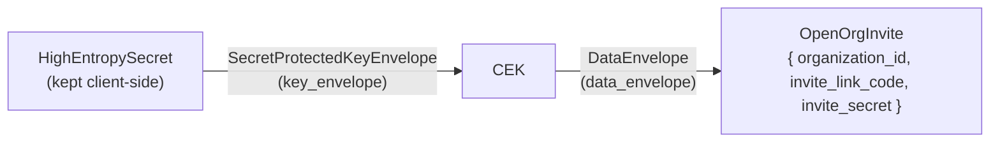

# open_org_invite_crypto

Open-organization-invite registration crossing.

The app seals an open org invite context on registration-start submit and unseals it on the accept
open-org-invite component after a successful registration-finish. This module owns the versioned
plaintext payload (`data_v1`), the domain types and crypto operations (`open_org_invite`), their
wire encoding (`serialization`), and the FFI-facing client methods (`client`).

Two envelopes protect the invite: a fresh CEK encrypts the plaintext, and a fresh 256-bit
`HighEntropySecret` encrypts that CEK. The paired envelopes travel together as
`SealedOpenOrgInviteData`; the `HighEntropySecret` is returned separately to the caller and kept
client-side. Both halves are required to unseal.

## Key-protection diagram

- _Audience:_ engineers touching this module.
- _Intent:_ show which key protects what.
- _Scope:_ the two envelopes composing `SealedOpenOrgInviteData` (excludes app flow, wire encoding,
  and FFI).

- `HighEntropySecret -> SecretProtectedKeyEnvelope -> CEK` (`key_envelope`): the CEK sealed under a
  fresh 32-byte `HighEntropySecret` returned to the caller and kept client-side.
- `CEK -> DataEnvelope -> OpenOrgInvite` (`data_envelope`): the versioned invite plaintext sealed
  under the fresh CEK. AES-GCM's auth tag at each layer is the substitution defense.
