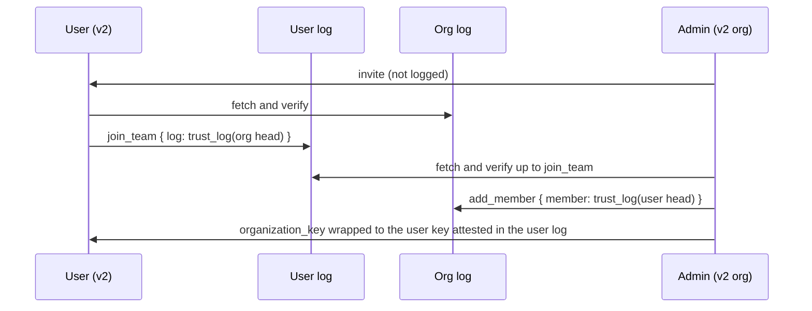
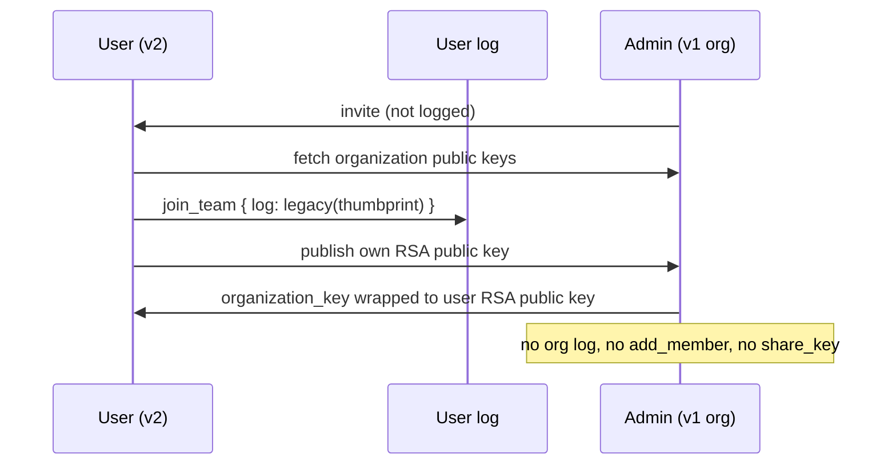
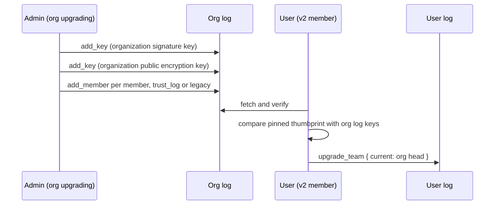
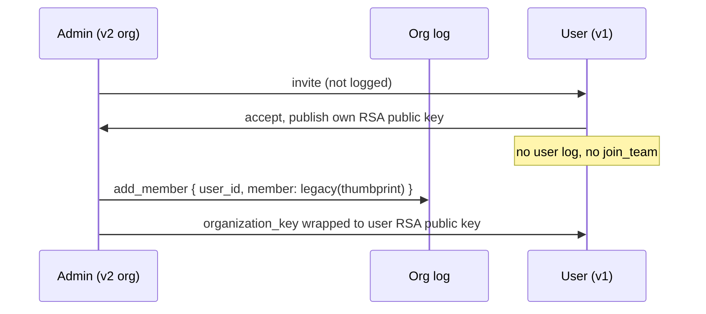
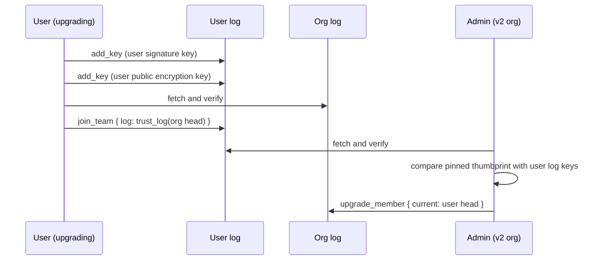
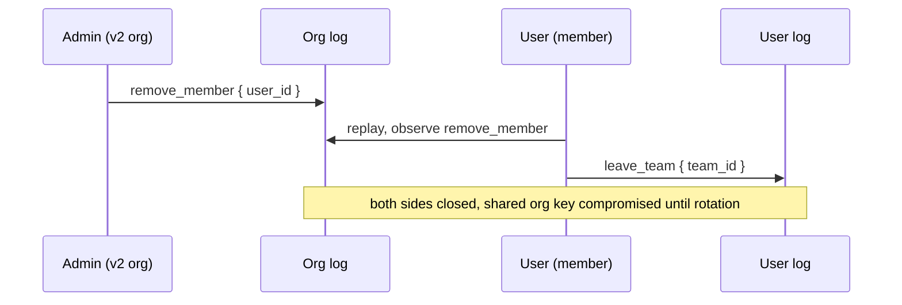
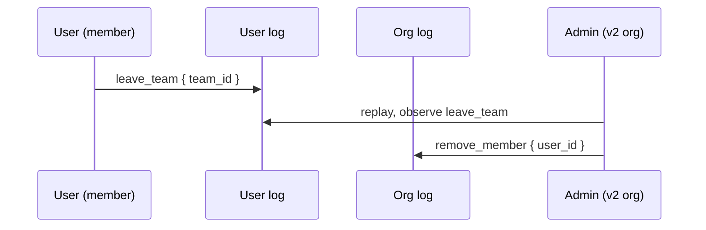
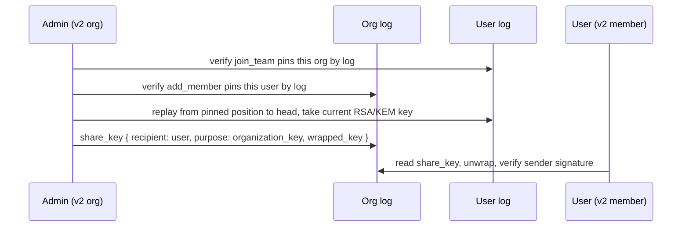

# Organization Cryptography V2 - Trust Log - Phase One

**Audience:** engineers implementing or reviewing organization cryptography v2 in clients, the SDK,
or the server.

**Status:** draft — under discussion inside Bitwarden.

**Owner:** Key-management team

**Related:** [Trust log design](./trust-log.md)

## Overview

This draft assumes that each entity (users, organizations) have a trust log where the owner can
publish messages. The trust logs properties are not further described here. This document
investigates the different operations a user will publish for v2 organization cryptography.

**Scope:** v1 of the protocol. Key revocation and automatic policy enablement are possible
extensions, but not part of the initial rollout.

## Assumptions

- The organization has a trust log, signed by the organization signature key and writable by
  privileged members.
- The user has a trust log, signed by the user's own signature key.

## Messages

`TrustLogLink` (log id + sequence + outer link hash) pins a counterparty that has a log.
`Thumbprint` pins a legacy counterparty that does not.

```
Thumbprint = bytes[32]         // over the counterparty's public keys

Pin = enum {
  legacy      { thumbprint: Thumbprint },
  trust_log   { link: TrustLogLink },
}
```

| Message             | Written in | Meaning                                                                  |
| ------------------- | ---------- | ------------------------------------------------------------------------ |
| `add_key`           | user, org  | The actor added a key it controls, in a given scope.                     |
| `join_team`         | user       | The user joined an organization, pinned as legacy or by log.             |
| `leave_team`        | user       | The user ended that membership.                                          |
| `add_member`        | org        | The organization admitted a member, pinned as legacy or by log.          |
| `remove_member`     | org        | The organization removed a member.                                       |
| `upgrade_team`      | user       | The user re-pins a team it had joined as legacy, now by log.             |
| `upgrade_member`    | org        | The organization re-pins a member it had admitted as legacy, now by log. |
| `set_security_flag` | user, org  | The user/organization changed a security flag.                           |
| `share_key`         | user, org  | The actor shared a key with a counterparty, sealed to that counterparty. |

```
AddKeyBody = {
  key_id:      bytes[16],
  thumbprint:  bytes[32],
  type:        enum { kem, public_key_encryption, signature },
  algorithm:   enum { ml-dsa, rsa },
  // What the key may be used for. A verifier must reject a signature made by a key
  // outside the scope the signed message requires.
  scope:       enum { default, invite_link },   // absent => default
  // For signature keys, you prove that you control the key by signing over the thumbprint
  // seqno and chain
  proof_of_possession: Signature({ thumbprint, id, timestamp, previous_outer_hash, seqno }) | null
}

JoinTeamBody = {
  team_id:  uuid,
  type:     enum { organization, provider },
  log:      Pin,        // legacy => thumbprint, non-legacy => log link
}

LeaveTeamBody = {
  team_id:  uuid,
}

AddMemberBody = {
  user_id:          uuid,
  member:           Pin,        // legacy => thumbprint, non-legacy => log link
}

RemoveMemberBody = {
  user_id:          uuid,
}

UpgradeTeamBody = {              // legacy -> non-legacy only
  team_id:  uuid,
  current:          TrustLogLink,
}

UpgradeMemberBody = {            // legacy -> non-legacy only
  user_id:          uuid,
  current:          TrustLogLink,
}

ShareKeyBody = {                // privileged: the wrapped key is readable only by the recipient
  recipient:        { kind: enum { user, organization }, id: uuid },
  purpose:          enum { organization_key, provider_key, account_recovery, emergency_access },
  wrapped_key:      bytes,          // signcrypted: sealed to the recipient KEM / RSA key
}

SetSecurityFlagBody = {
  disable_no_trustlog_organization_keys: bool | null,
  ...: bool,
}
```

## Flows

Invite (the organization inviting a user) carries no trust log message in v1 of the protocol. The
two logged steps are **accept** (the user agrees, in the user's log) and **confirm** (the
organization admits the user, in the organization's log).

> **Note:** invite is not recorded for the first release — for either invite flow, invite email or
> invite link. Recording it in the organization's log would give autoconfirm something to check
> against. The server would still have to be trusted that the correct user is joining, but it could
> not lie about the fact that a user was invited: if no user was invited, the server cannot pretend
> one was.

### V2 user joins V2 org



1. **Accept** — the user fetches and verifies the organization's log, then appends to its own log:
   `join_team { team_id, log: trust_log(link to the org head it verified) }`.
2. **Confirm** — a privileged member fetches and verifies the user's log up to and including that
   `join_team`, then appends to the organization's log:
   `add_member { user_id, member: trust_log(link to the user head it verified) }`.
3. **Share** — the admin wraps the organization key to the user's RSA/KEM key attested by `add_key`
   in the user's log at the pinned position. (This MAY be signcryption)

### V2 user joins V1 org



1. **Accept** — the user appends
   `join_team { team_id, log: legacy(thumbprint over the organization's public keys) }`.
2. **Confirm** — the admin wraps the organization key to the user's public RSA key, and writes no
   trust log message.

### V2 user joined V1 org and org upgrades to V2



1. The organization creates its log and appends `add_key` for its signature key, then a second
   `add_key` for its public encryption key.
2. For every existing member, the organization appends `add_member` — `trust_log(...)` for members
   that have a log, `legacy(thumbprint)` for the rest. There is no earlier organization-side pin to
   update, so this is `add_member`, not `upgrade_member`.
3. Each member verifies the new organization log, checks that the thumbprint it pinned at
   `join_team` matches the keys the log now claims, and appends
   `upgrade_team { team_id, current: link to the org head }`.

### V1 user joins V2 org



The user has no log, so the user cannot accept in a verifiable way.

1. **Accept** — the user accepts the invite the v1 way and publishes its public keys to the server.
   It has no log, so there is no `join_team` and nothing about the acceptance is attested.
2. **Confirm** — the admin fetches the user's public keys from the server and appends to the
   organization's log:
   `add_member { user_id, member: legacy(thumbprint over the user's public keys) }`.
3. **Share** — the admin wraps the organization key to the user's public RSA key, the v1 way. The
   key comes from the server and is pinned only by the thumbprint in `add_member`, so the share is
   bound to a key the user never attested to.

If the organization has `disable_no_trustlog_organization_keys` enabled, confirm is refused instead
— refusing the legacy pin is what stops the organization key from being shared to a server-supplied
key.

### V1 user joined V2 org and user upgrades to V2



1. The user creates its log and appends `add_key` for its signature key, then a second `add_key` for
   its public encryption key.
2. The user verifies the organization's log and appends
   `join_team { team_id, log: trust_log(link to the org head) }`. There is no earlier user-side pin
   to update, so this is `join_team`, not `upgrade_team`.
3. A privileged member verifies the new user log, checks that the thumbprint pinned at `add_member`
   matches the keys the user log claims, and appends
   `upgrade_member { user_id, current: link to the user head }`.

### Organization removes member

The two sides are independent messages: the organization records the removal in its own log, the
user records it in theirs. Neither can write the other's log, so removal is one-sided until the user
observes it.

1. A privileged member appends `remove_member { user_id }` to the organization's log. From that link
   on, the organization's log state no longer counts the user as a member.
2. The user observes the removal when it next replays the organization's log and appends
   `leave_team { team_id }` to its own log, closing the membership on its side.

Any key the organization shared with the removed member (`share_key { purpose: organization_key }`)
must be considered known to that member forever. Removal does not unshare it — rotating the
organization key and re-sharing to the remaining members does.

> **Info:** the trust log only records the removal. The server still enforces it the way it does
> today: once the user is out, access control stops serving that user the shared keys and the data
> they protect. The log makes the removal provable.



### User leaves organization

Same two messages, initiated from the other end.

1. The user appends `leave_team { team_id }` to its own log.
2. A privileged member observes it when replaying the user's log and appends
   `remove_member { user_id }` to the organization's log.

A `leave_team` is unilateral and effective on the user's side immediately: it does not need the
organization's acknowledgement, and the organization cannot make the user's log claim a membership
the user has closed.



### Upgrade to signcrypted organization key / signcrypted account recovery

**Precondition:** the membership must be mutually trust-log based — the user's `join_team` pins the
organization by log and the organization's `add_member` (or `upgrade_member`) pins the user by log.

Both upgrades are the same message in opposite directions:

- **organization key** — an admin shares the organization key with a member:
  `share_key { recipient: user, purpose: organization_key }` in the **organization's** log.
- **account recovery** — a member shares its account recovery key with the organization:
  `share_key { recipient: organization, purpose: account_recovery }` in the **user's** log.

The sender re-verifies the recipient's log from the pinned position to its head, picks the
recipient's current RSA/KEM key, signcrypts the shared key to it, and appends `share_key`. The
message is `privileged`: the chain counts it, so the server cannot hide that a share happened, but
only the recipient can unwrap it.



Replacing a shared key (organization key rotation, recovery key rotation) is a new `share_key` for
the same `purpose` — the latest one in the log wins. Revoking a share is out of scope for v1; it
follows key revocation.

### Invite link (follow-up)

Not part of the initial rollout.

Confirm with trustlogs from the organization's side requires sharing a key to the user, and
recording the joining message. To do this, a special key signing key is created and published on the
trust log, scoped to joining a member. The member, on joining uses the signing key and appends a
join message to the trust log, and a key share message.

Until then, joining via an invite link is a V1 membership.

## Rollout plan

| #   | Phase                        | Messages                                                      | Ships as                 |
| --- | ---------------------------- | ------------------------------------------------------------- | ------------------------ |
| 1   | Trust logs exist             | `add_key`                                                     | own release              |
| 2   | Record membership            | `join_team`, `leave_team`, `add_member`, `remove_member`      | own release              |
| 3   | Upgrade pins                 | `upgrade_team`, `upgrade_member`                              | own release              |
| 4   | Disable legacy compatibility | `set_security_flag { disable_no_trustlog_organization_keys }` | separate release, opt-in |
| 5   | Share signcrypted key        | `share_key`                                                   | own release              |
| 6   | UI warning                   | —                                                             | client-only              |
| 7   | Signcrypted keys enforced    | `share_key`                                                   | own release              |

1. **Organizations and users gain a trust log** with their own signature key. Nothing depends on it
   yet; logs are created and `add_key` recorded so that later phases have something to pin.
2. **Record join and leave on the trust log.** New memberships write both sides. Counterparties that
   have not reached phase 1 are recorded as legacy, so this phase works against any client.
3. **Upgrade the trust log pins.** Memberships recorded as legacy in phase 2 are re-pinned by log
   position as each counterparty gains a log (`upgrade_team` / `upgrade_member`). This runs as a
   background reconciliation, not a user-facing action.
4. **Disable legacy compatibility** — a separate update, because it is the only breaking phase. With
   `disable_no_trustlog_organization_keys` set, an organization refuses legacy pins and legacy
   members outright, so every key an actor relies on must come from a signed log. This is what
   closes the server-side key injection vulnerability (the ETH finding): a server can no longer hand
   a client an unattested public key for a counterparty.
5. **Add the signcrypted key and share it with owner on org creation** -> Key replacement fixed for
   admins
6. Add signcrypted key on manual confirm. -> Key replacement fixed for newly joining users
7. **UI warning.** Before the old key path is removed, users on clients that cannot read the
   signcrypted key must be told, or phase 7 locks them out silently.
8. Re-share org keys to users -> Key replacement fixed for existing users
9. Re-share account recovery keys to orgs -> Key replacement fixed for existing users account
   recoveries
