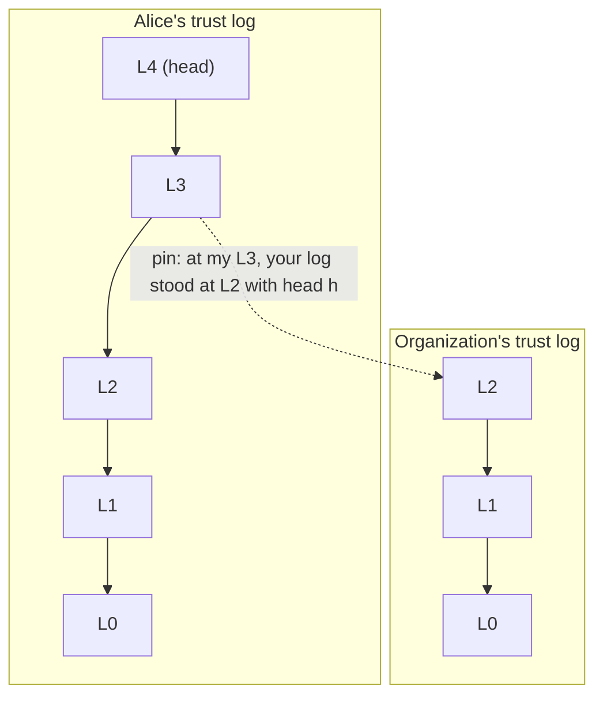
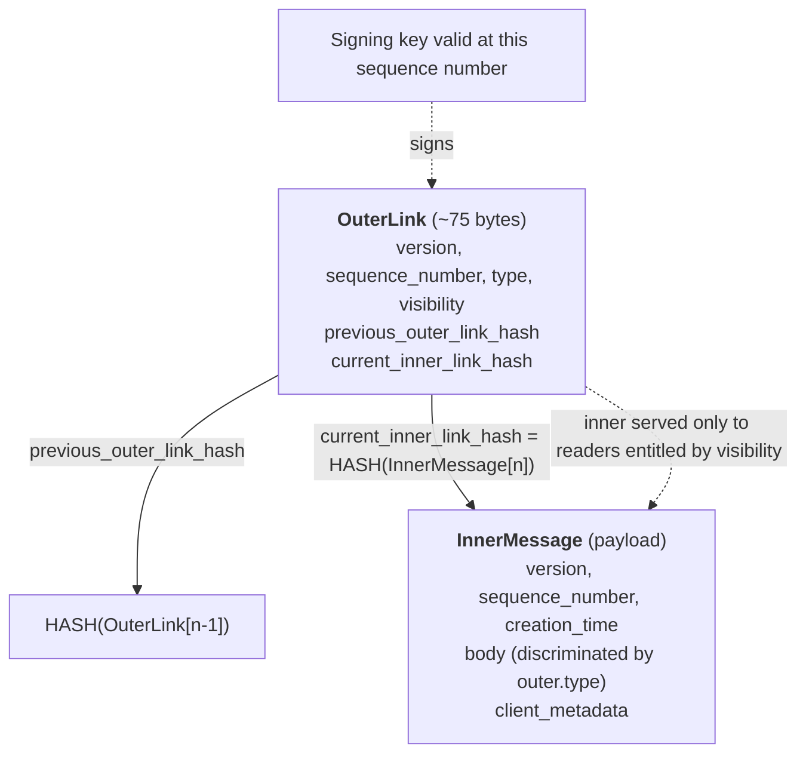
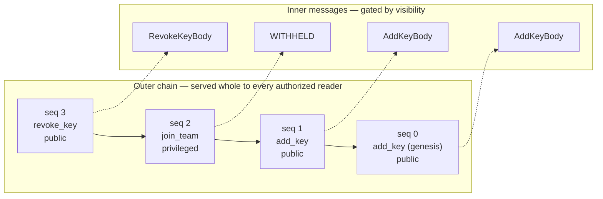
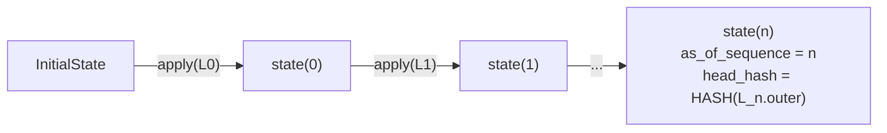
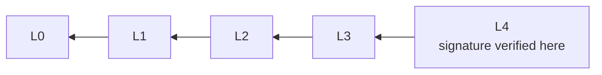
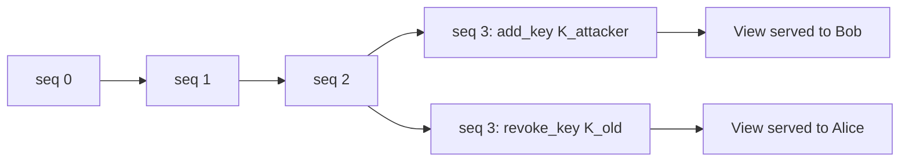

# Trust log design

**Audience:** engineers implementing or reviewing the trust log in clients, the SDK, or the server.

**Status:** draft — under discussion inside Bitwarden.

**Owner:** Key-management team

## Overview

The trust log is a tamper-resistant, append-only, signed log of security-critical actions, kept per
actor — a user, an organization, or a provider — and served by an untrusted server. Each log entry
is a **link**, split into a small signed **outer link** and an **inner message**. The chain of outer
links provides completeness: no action can be inserted, removed, or reordered without detection.

This set of logs acts as the key-transparency system for Bitwarden. Additionally, it allows us to
cryptographically record and attest to permissions (policies around data transfer, etc).

This will serve as the foundation to:

- Organization Encryption V2
- Organization Cryptographically Enforced Policies
  - Automatic Key Connector Enrollment
  - Automatic Data Ownership Transfer
  - Automatic Retroactive Account Recovery Enrollment
  - Automatic Activation of Auto-Confirmation
    - Safer Autoconfirmation
- Emergency Access V2
- (Maybe) Device Keys

With the key-transparency effective, this will prevent most fingerprints while preventing the server
from injecting public keys.

## Introduction

The trust log is a tamper-resistant, append-only data structure that records actions. Each actor — a
user, an organization, or a provider — has one trust log each. The goal is to record actions
concerning that actor in a way that provably came from the actor, that can be revoked (by appending
an action stating the revocation), and that the server can neither inject into, modify, nor omit
from.

The trust log is intended to become the central root from which clients determine:

- the currently valid keys of other users, organizations, and providers;
- their own currently valid keys;
- the organizations and providers they agreed to be part of;
- the security-critical permissions an organization holds over a user;
- the devices currently active for a user.

Each entry in the log is a **link**, and every link has two parts:

- an **outer link** — small, always visible to any authorized reader of the log, and **the thing
  that is signed**;
- an **inner message** — the full payload, whose readability is gated by the outer link's declared
  visibility.

The chain of outer links gives _completeness_: the account holder can prove no action was inserted,
removed, or reordered.

### Goals

| #   | Goal                                                                                                                                                   |
| --- | ------------------------------------------------------------------------------------------------------------------------------------------------------ |
| G1  | An account holder can detect any modification, reordering, or omission of their own history.                                                           |
| G2  | A relying party can determine which keys an account controlled _at a given point in its history_, without trusting the server.                         |
| G3  | The server cannot suppress a security-critical action (key revocation, policy change)                                                                  |
| G4  | Confidential actions (organization membership, device inventory) stay confidential from unauthorized readers while still being _counted_ in the chain. |

---

## Architecture overview

The logs and the references between them:



A link consists of two parts, and each commits to the next:



And the chain, with one inner message withheld from an unauthorized reader:



---

## Data structures

### Outer link

```
OuterLink = {
  version:                  uint,        // structure + algorithm version
  sequence_number:          uint,        // 0 for genesis, strictly +1 thereafter
  previous_outer_link_hash: bytes[32],   // HASH of the previous OuterLink; all-zero for genesis
  current_inner_link_hash:  bytes[32],   // HASH of this link's InnerMessage
  type:                     MessageType, // see message types
  visibility:               Visibility,  // public, privileged or private; see visibility
}
```

The key signing the outer link must be of `type = signature` and must be valid at this
`sequence_number` ([Chain validation](#chain-validation)).

Rationale: `type` and `visibility` are inside the signed structure so the server cannot misrepresent
what an action was, nor how confidential it is ([Visibility](#visibility)).

### Inner message

```
InnerMessage = {
  version:                     uint,       // structure + algorithm version
  sequence_number:             uint,       // must equal the outer link's sequence_number
  creation_time:               uint64,     // client-asserted, UNIX ms — untrusted
  body:                        Body,       // discriminated by the outer link's `type`
  client_metadata:             ClientMetadata,
}

ClientMetadata = {
  client_type:    enum { web, browser_extension, desktop, mobile, cli, server },
  client_version: string,
  device_id:      bytes[16] | null,
}
```

### Signed outer link

```
SignedOuterLink = {
  outer:      OuterLink,
  signature:  bytes,     // over the canonical encoding of `outer`
}
```

### Genesis link

The link at `sequence_number = 0` must be `add_key` carrying a key of `type = signature`, must be
self-signed by that key, and must carry `previous_outer_link_hash` of all zeroes. The body carries
only the key's thumbprint, so checking the genesis self-signature requires the verifying key itself,
which is fetched separately and checked against that thumbprint. A trust log must always at least
have one valid signing key.

---

## Visibility

```
Visibility = enum { public, privileged, private }
```

| Value        | Who may read the inner message                                                                                                            |
| ------------ | ----------------------------------------------------------------------------------------------------------------------------------------- |
| `public`     | Anyone who may read the outer chain.                                                                                                      |
| `privileged` | The account holder, and principals sharing the relevant scope (e.g. members/admins of the organization named in the body and the server). |
| `private`    | The account holder only.                                                                                                                  |

Each message type maps statically to one visibility ([Message types](#message-types)), so a verifier
must reject any link whose `outer.visibility` disagrees with that mapping; the server therefore
cannot claim an action is more confidential than it is in order to withhold it (G3).

Private links are not yet specified in this document. If they are implemented, then the body would
be encrypted when stored on the server, so that the server cannot read the body.

### Preventing omission by the server

The outer chain is served **in full, to every authorized reader, regardless of visibility**.
Visibility gates inner messages only. Since sequence numbers are contiguous and each link commits to
the previous link's hash, a missing link in the interior of the chain is immediately visible (the
_Sequence_ and _Outer chain_ checks, [Chain validation](#chain-validation)). A missing link at the
_tail_ is **not** covered by this document: an actor notices truncation of its own log because it
knows its own head, and a relying party notices it only as far as its last pin
([Log application rules](#log-application-rules)). Detecting truncation against an independent
witness is an open problem here.

If the server serves the outer link but refuses an inner message the reader is entitled to — this is
detectable but not preventable by this design. This counts as an attack by the server. It is a
denial of service, and clients must treat "outer link present, entitled inner message unavailable"
as a verification failure (the _Entitlement_ check, [Chain validation](#chain-validation)), not as a
skippable entry.

---

## Message types

Each link carries a message type. For this document, only two message types are relevant: `add_key`
and `revoke_key`.

| Type         | Description                            | Principals                   | Visibility |
| ------------ | -------------------------------------- | ---------------------------- | ---------- |
| `add_key`    | The actor added a key it controls.     | user, organization, provider | `public`   |
| `revoke_key` | The actor revoked one of its own keys. | user, organization, provider | `public`   |

Applications specify their own message types on top of these, for instance those in
[Organization Cryptography V2](./organization-cryptography-v2.md).

The `private` visibility value is currently unused.

---

## Log state

The log state is the local accumulated state obtained by applying all actions in the log.

```
state(n) = apply links[0], links[1], ..., links[n] in order, starting from InitialState
```



Each `apply` is a pure function of `(state, outer, inner)`.

Every key an actor learns of, its own or a counterparty's, is recorded as a `KeyState`, derived from
the `add_key` / `revoke_key` links of whichever log the key was read from:

```
KeyState = {
  key_id:               bytes[16],
  type:                 enum { kem, public_key_encryption, signature },
  algorithm:            enum { ml-dsa, rsa },
  thumbprint:           bytes[16],         // as carried by the add_key body; the public key
                                           // itself is fetched out of band and checked against it
  scope:                enum { default, invite_link },
  added_at_sequence:    uint,              // position in the log this key was read from
  revoked_at_sequence:  uint | null,       // null while valid
  revocation_reason:    enum { rotation, compromise } | null,
}
```

The sequence numbers belong to the log the key came from. The key is only valid for the log it came
from for the Chain validation check.

Revoked keys are **retained, not deleted**. Removing them would destroy the ability to check a
signature made before the revocation, which must stay checkable forever.

### Log application rules

| Message type | Effect on state                                                                                       |
| ------------ | ----------------------------------------------------------------------------------------------------- |
| `add_key`    | Insert into this trust log's key set (`trust_log_keys`). Genesis establishes the first signature key. |
| `revoke_key` | Set `revoked_at_sequence` + `revocation_reason` on that key of `trust_log_keys`.                      |

Application-specific message types carry their own effects on the rest of the state — memberships,
policies, and the positions at which this log has witnessed another actor's log. Those are specified
by the application, for instance in
[Organization Cryptography V2](./organization-cryptography-v2.md).

---

## Scaling: sparse replay

### Post-quantum signature size issues

Post-quantum signatures ([FIPS204], ML-DSA) signatures are large, roughly 2-4KiB per signature. This
means that for large sets of operations on a chain, we do not want to bear the cost of downloading
all of the signatures. For example:

| Links     | Outer chain links | Signatures |
| --------- | ----------------- | ---------- |
| 10,000    | ~0.75 MB          | ~20 MB     |
| 100,000   | ~7.5 MB           | ~200 MB    |
| 1,000,000 | ~75 MB            | ~2 GB      |

We want to optimize this to eliminate login latency and network transfer, especially for large
organizations. For this, we introduce sparse replay and checkpoints.

#### Sparse replay — example

A concrete log: an organization with **25,000 current members**.

Per-link sizes, ML-DSA-44:

```
outer link          ~75 bytes     (two 32-byte hashes and small integers)
signature         ~2,420 bytes    (FIPS 204, ML-DSA-44)
inner message       ~200 bytes    (chain hash, creation_time, client metadata,
                                    and a ~70-byte body; an add_key
                                    body carries a thumbprint, not a public key)
```

Link inventory:

```
add_member                 25,000
add_key                         2     (signature key + encryption key, at genesis)
                           ------
total                      25,002
```

| Reader profile                                              | Outer links | Signatures      | Inner messages | Total       |
| ----------------------------------------------------------- | ----------- | --------------- | -------------- | ----------- |
| **Full replay** — every link, signature, inner message      | ~1.9 MB     | ~61 MB (25,002) | ~5.0 MB        | **~67 MB**  |
| **Sparse, no types requested** — key events only            | ~1.9 MB     | ~4.8 KB (2)     | ~0.4 KB (2)    | **~1.9 MB** |
| **Sparse + checkpoint** — one day's activity, ~50 new links | ~3.8 KB     | ~121 KB (50)    | ~10 KB         | **~135 KB** |

### Sparse replay

The key idea of sparse replay is that a reader needs to verify only two things in full: **every
change to the log's key set**, and **the head**. Everything in between is verified implicitly by the
signature on the head ([Why skipping signatures is sound](#why-skipping-signatures-is-sound)).

A reader therefore requests the message types it actually cares about, and the server serves:

- the **complete outer chain**, every link, always —
  [Preventing omission by the server](#preventing-omission-by-the-server) is unchanged and
  non-negotiable;
- signatures and inner messages for the requested types, **plus every `add_key` and `revoke_key`
  link, whether or not they were requested**.

A request for the outer chain accordingly names the types wanted and whether signatures are wanted.

| Check                 | On a replayed link | On a skipped link            |
| --------------------- | ------------------ | ---------------------------- |
| Version               | must               | must                         |
| Sequence              | must               | **must**                     |
| Outer hash chain      | must               | **must**                     |
| Registry visibility   | must               | must                         |
| Signature             | must               | may skip                     |
| Inner binding         | must               | must, if the inner arrived   |
| Entitlement           | must               | relative to the types wanted |
| Body validity + state | must               | may skip                     |
| Principal kind        | must               | must                         |

1. **`add_key` and `revoke_key` are never skippable.** A verifier must fully validate every key
   event of the log it is replaying — signature, inner message, and body — whatever else it asked
   for. Skipping a `revoke_key` would leave a revoked key in the derived validity set, and every
   signature check is evaluated against that set.
2. **Hash and sequence integrity are never skippable.** Contiguous sequence numbers and an unbroken
   outer hash chain must be checked over every link, including skipped ones. This is what makes
   skipping signatures sound at all
   ([Why skipping signatures is sound](#why-skipping-signatures-is-sound)).

### Why skipping signatures is sound



`HASH(L3)` is committed by `L4`, `HASH(L2)` by `L3`, and so on, so one valid signature at `L4` fixes
the content of `L0..L3` as well. The verified link is normally the head.

Each outer link commits to the hash of its predecessor, so a single verified signature authenticates
the **entire prefix** below it, not merely the link it sits on. This follows by induction over the
chain.

In practice this means a reader that

1. checks the unbroken hash chain and contiguous sequence numbers over **every** outer link, and
2. verifies the signature on at least one link at or after the highest sequence it relies on —
   normally the head,

has authenticated the content of every earlier link, including the ones whose signatures it never
fetched. Note that step 2 is why key events are never skippable: the head's signature counts only if
the key that made it was valid at the head, and that is knowable only from the complete set of key
events ([Sparse replay](#sparse-replay) rule 1).

### Checkpoints and incremental replay

A client may persist a verified checkpoint and on the next sync replay only the links after it. This
is out of scope for this version of the document.

---

## Split view attack

The hash chain makes a log internally consistent, but internal consistency says nothing about
_which_ chain a reader was shown. The server is the sole distributor of logs, so it can maintain two
divergent chains for the same actor and serve one to Alice and the other to Bob. Both views validate
under [Chain validation](#chain-validation).



The consequence is that a key revocation can be made effective for the account holder while never
becoming effective for the relying parties encrypting to that account, and vice versa: an
attacker-controlled key can be accepted by everyone except the account holder, who would notice it.
Each party's view is self-consistent, so no local check fires. The `pin` mechanism
([Log state](#log-state)) narrows the window between parties who exchange pins, but does not close
it: the server chooses which view each party pins against.

Detecting a split view requires comparing views across parties — gossip between clients, a
transparency log with an independent witness set, or a signed-tree-head auditing protocol as in
[RFC9162] and [CONIKS]. **Resolving the split view attack is out of scope for this document.**

We will revisit this later; most likely using a tlog that holds a merkle tree that in each epoch
commits to all latest head hashes.

---

## Chain validation

A verifier processing a trust log must, in sequence order:

1. **Version.** `outer.version` is implemented. Reject otherwise.
2. **Sequence.** `seq == 0` for the first link; `seq == prev.seq + 1` thereafter.
3. **Outer chain.** `outer.previous_outer_link_hash == HASH(prev.outer)`; all-zero at genesis.
4. **Registry.** `outer.visibility == REGISTRY[outer.type].visibility`.
5. **Signature.** `signature` verifies over `outer` under the key its own envelope identifies, that
   key is of `type = signature` in this log, and it was **valid at this sequence number**.
6. **Inner binding.** If the inner message was received:
   `HASH(inner) == outer.current_inner_link_hash` and
   `inner.sequence_number == outer.sequence_number`.
7. **Entitlement.** If the verifier is entitled to the inner message under `outer.visibility`,
   requested it ([Sparse replay](#sparse-replay)), and did not receive it: **fail**. Do not skip.
8. **Body validity.** The body parses under `outer.type`, and its semantic preconditions hold
   against derived state ([Log application rules](#log-application-rules)).

Failure of any check invalidates the log **from that link onward**. Prefix links already verified
remain valid — this matters, because it means a compromised tail does not erase provable history.

---

## Security considerations

This whole document is a security consideration; this section states what the construction defends
against.

| Attack                                        | Defeated by                                                                                               |
| --------------------------------------------- | --------------------------------------------------------------------------------------------------------- |
| Insert a forged action                        | Signature over the outer link ([Chain validation](#chain-validation))                                     |
| Delete an interior action                     | Contiguous sequence + hash chain ([Chain validation](#chain-validation))                                  |
| Reorder actions                               | Hash chain ([Chain validation](#chain-validation))                                                        |
| Swap an inner payload between links           | `current_inner_link_hash` + duplicated sequence number ([Chain validation](#chain-validation))            |
| Hide a key revocation behind confidentiality  | Type→visibility binding ([Visibility](#visibility), [Chain validation](#chain-validation))                |
| Misrepresent which key signed a link          | The signature names its own key, checked against the validity set ([Chain validation](#chain-validation)) |
| Backdate an action to before a key revocation | Position-based key validity — timestamps are not consulted ([Chain validation](#chain-validation))        |

---

## Related Reading

- **[FIPS204]** NIST, "Module-Lattice-Based Digital Signature Standard (ML-DSA)", FIPS 204,
  August 2024.
- **[RFC9162]** Laurie, B., et al., "Certificate Transparency Version 2.0", RFC 9162, December 2021.
- **[CONIKS]** Melara, M., et al., "CONIKS: Bringing Key Transparency to End Users", USENIX
  Security 2015. The per-user key-directory model, and the split-view problem.
- **[SEEMless]** Chase, M., Deshpande, A., Ghosh, E., Malvai, H., "SEEMless: Secure End-to-End
  Encrypted Messaging with less trust", CCS 2019. Sparse-trie key transparency with privacy.
