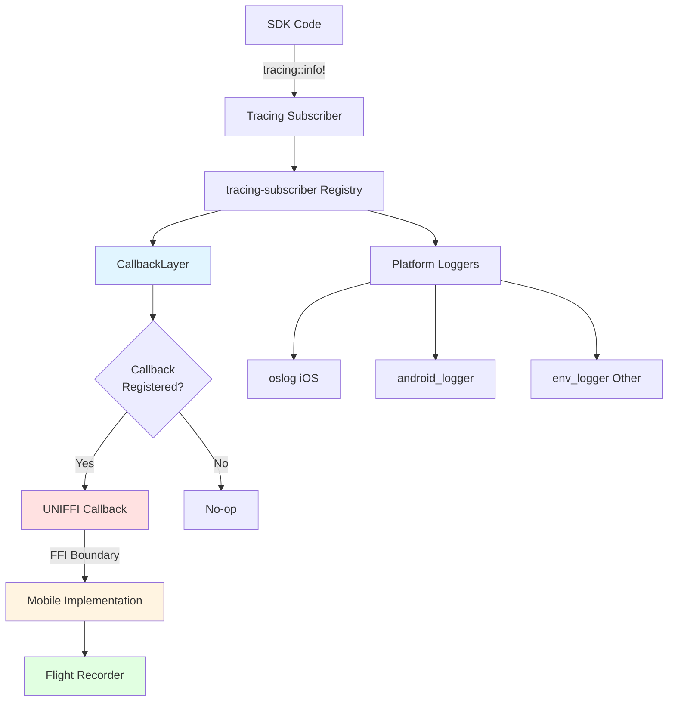
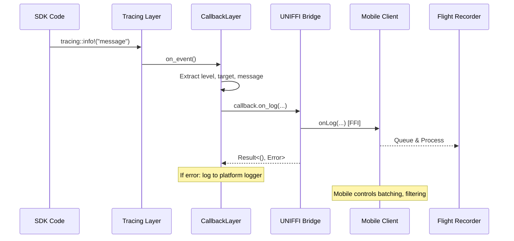

# SDK Logging Callback Guide

## Overview

The Bitwarden SDK provides an optional logging callback interface that enables mobile applications
to receive trace logs from the SDK and forward them to observability systems like Flight Recorder.
This document explains the design, integration patterns, and best practices for using the logging
callback feature.

## Purpose and Use Case

The logging callback addresses mobile teams' requirements for:

- **Observability**: Collecting SDK trace events in centralized monitoring systems
- **Debugging**: Capturing SDK behavior for troubleshooting production issues
- **Flight Recorder Integration**: Feeding SDK logs into mobile observability platforms

The callback is entirely optional. Platform-specific loggers (oslog on iOS, android_logger on
Android) continue functioning independently whether or not a callback is registered.

## Architecture

### Design Principles

1. **Non-intrusive**: The SDK operates identically with or without a callback registered
2. **Thread-safe**: Multiple SDK threads may invoke the callback concurrently
3. **Error-resilient**: Mobile callback failures do not crash the SDK
4. **Simple contract**: Mobile teams receive level, target, and message - all other decisions are
   theirs

### Data Flow



Platform loggers (oslog/android_logger) operate in parallel, receiving the same events
independently.

### Callback Invocation Flow



## LogCallback Interface

### Trait Definition

```rust
pub trait LogCallback: Send + Sync {
    /// Called when SDK emits a log entry
    ///
    /// # Parameters
    /// - level: Log level string ("TRACE", "DEBUG", "INFO", "WARN", "ERROR")
    /// - target: Module that emitted log (e.g., "bitwarden_core::auth")
    /// - message: The formatted log message
    ///
    /// # Returns
    /// Result<()> - Return errors rather than panicking
    fn on_log(&self, level: String, target: String, message: String) -> Result<()>;
}
```

## Quick Start

Call `initLogger()` once before creating clients:

```kotlin
// Kotlin
initLogger(FlightRecorderCallback())
val client = Client(tokenProvider, settings)
```

```swift
// Swift
initLogger(callback: FlightRecorderCallback())
let client = try Client(tokenProvider: tokenProvider, settings: settings)
```

Skip `initLogger()` to use only platform loggers (oslog/logcat).

### Thread Safety Requirements

The `Send + Sync` bounds are mandatory. The SDK invokes callbacks from arbitrary background threads,
potentially concurrently. Mobile implementations **must** use thread-safe patterns:

- **Kotlin**: `ConcurrentLinkedQueue`, synchronized blocks, or coroutine channels
- **Swift**: `DispatchQueue`, `OSAllocatedUnfairLock`, or actor isolation

**Critical**: Callbacks are invoked on SDK background threads, NOT the main/UI thread. Performing UI
updates directly in the callback will cause crashes.

## Performance Considerations

### Callback Execution Requirements

Callbacks should return quickly (ideally < 1ms). Blocking operations in the callback delay SDK
operations. Follow these patterns:

✅ **Do:**

- Queue logs to thread-safe data structure immediately
- Process queued logs asynchronously in background
- Batch multiple logs per Flight Recorder API call
- Use timeouts for Flight Recorder network calls
- Handle errors gracefully (catch exceptions, return errors)

❌ **Don't:**

- Make synchronous network calls in callback
- Perform expensive computation in callback
- Access shared state without synchronization
- Update UI directly (wrong thread!)
- Throw exceptions without catching

### Filtering Strategy

The SDK sends all INFO+ logs to the callback. Mobile teams filter based on requirements:

```kotlin
override fun onLog(level: String, target: String, message: String) {
    // Example: Only forward WARN and ERROR to Flight Recorder
    if (level == "WARN" || level == "ERROR") {
        logQueue.offer(LogEntry(level, target, message))
    }
    // INFO logs are ignored
}
```

## Known Limitations

The current implementation has these characteristics:

1. **Span Support**: Only individual log events are forwarded, not span lifecycle events
   (enter/exit/close). Mobile teams receive logs without hierarchical operation context.

2. **Structured Fields**: Log metadata (user IDs, request IDs, etc.) is flattened to strings. Mobile
   teams cannot access structured key-value data without parsing message strings.

3. **Dynamic Filtering**: Mobile teams cannot adjust the SDK's filter level at runtime. The callback
   receives all INFO+ logs regardless of mobile interest.

4. **Observability**: The callback mechanism itself does not emit metrics (success rate, invocation
   latency, error frequency). Mobile teams implement monitoring in their callback implementations.
