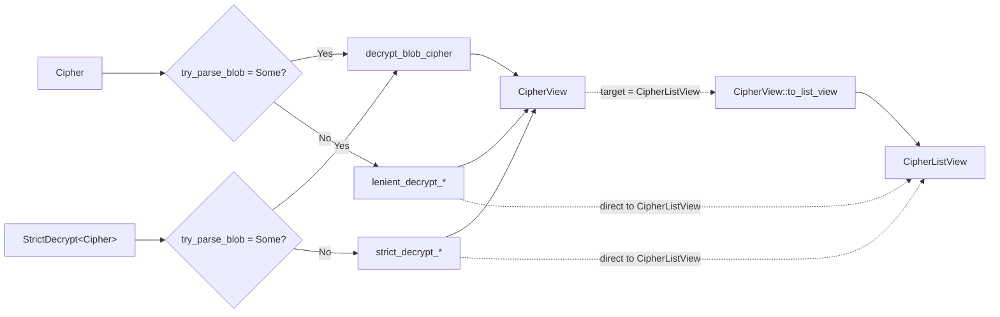

# Cipher Module

Data model, encryption, and decryption for vault items (logins, cards, identities, secure notes, SSH
keys).

## Type layers

| Type                                        | Role                           | Notes                                                                                                                                                                                                                             |
| ------------------------------------------- | ------------------------------ | --------------------------------------------------------------------------------------------------------------------------------------------------------------------------------------------------------------------------------- |
| `Cipher`                                    | Server / storage model         | Encrypted payload + metadata. Sensitive data is either per-field `EncString`s (legacy) or a single sealed `data` string (blob — see below).                                                                                       |
| `CipherView`                                | Fully decrypted DTO            | Returned to clients for display and editing.                                                                                                                                                                                      |
| `CipherListView`                            | Summary projection for list UI | Plaintext `name` + `subtitle` + type-specific preview + copyable hints. Smaller memory footprint than `CipherView` and omits highly sensitive fields (e.g. password, SSH private key) — one row per cipher times the whole vault. |
| `CipherCreateRequest` / `CipherEditRequest` | Public input DTOs              | Entry points into `CiphersClient::create` / `edit`.                                                                                                                                                                               |
| `CipherRequestModel`                        | Server wire format             | What `create` / `edit` send to the API.                                                                                                                                                                                           |

## Storage formats

A `Cipher` can be stored in one of two formats at rest, detected per-cipher:

- **Legacy (field-level)** — individual sensitive fields (`name`, `notes`, `login.username`, etc.)
  are each encrypted as separate `EncString`s.
- **Blob** — sensitive item content (name, notes, type-data, custom fields, password history) sealed
  into a single `Cipher.data` opaque string via a data envelope (CEK + wrapped key, see
  [`blob/`](./blob/)). The opaque string is JSON stored verbatim —
  `{"format_version":…,"wrapped_cek":…,"envelope":…}` — where `wrapped_cek` and `envelope` are the
  base64 inner crypto material. Everything else — non-sensitive metadata (`favorite`, `folder_id`,
  dates) and separately-encrypted data (`attachments`, `local_data`) — stays alongside the blob on
  the `Cipher` struct.

Detection happens via `blob::try_parse_blob(&Cipher)`, which returns `Some(SealedCipherBlob)` when
the `data` string is a JSON object carrying the top-level `format_version` key and `None` otherwise
(legacy field-level `CipherData` never contains it — the same probe is mirrored server-side). Blob
and legacy ciphers coexist during rollout — a single `Vec<Cipher>` from the API routinely contains
both.

## Decryption flow

`Cipher` implements `Decryptable<…, CipherView>` and `Decryptable<…, CipherListView>` directly, so
external callers (`bitwarden-exporters`, `bitwarden-user-crypto-management` key rotation, and tests)
just call `key_store.decrypt(&cipher)` without choosing a path. The impl calls
`blob::try_parse_blob(&Cipher)` and, when it returns `Some`, dispatches to the blob unseal flow; a
`None` routes to the legacy lenient path. `decrypt_list` likewise accepts a homogeneous
`Vec<Cipher>` and routes per-cipher.

`StrictDecrypt<Cipher>` is a `pub(crate)` wrapper that implements the same `Decryptable` traits, but
its legacy branch propagates field decryption errors instead of silently nulling them out. It also
dispatches blob ciphers through the blob path (the strict/lenient distinction does not apply to blob
unseal — it is all-or-nothing). `CiphersClient` constructs `StrictDecrypt(cipher)` only when the
`PM-34500-strict_cipher_decryption` feature flag is on, and falls back to bare `Cipher` otherwise.
The flag and `StrictDecrypt` are both scheduled for removal in PM-34531.

### Dispatch matrix

| Cipher format | Wrapper                     | `CipherView` path             | `CipherListView` path                              |
| ------------- | --------------------------- | ----------------------------- | -------------------------------------------------- |
| Blob          | `Cipher` or `StrictDecrypt` | `decrypt_blob_cipher`         | `decrypt_blob_cipher` → `CipherView::to_list_view` |
| Legacy        | `Cipher` (default)          | `lenient_decrypt_cipher_view` | `lenient_decrypt_cipher_list_view`                 |
| Legacy        | `StrictDecrypt<Cipher>`     | `strict_decrypt_cipher_view`  | `strict_decrypt_cipher_list_view`                  |

## Encryption flow

Today, all encryption entry points (`CiphersClient::encrypt`, `encrypt_list`,
`encrypt_cipher_for_rotation`, and the `create` / `edit` request paths) go through the **legacy
field-level path** via the `CompositeEncryptable` impls on `CipherView`,
`CipherCreateRequestInternal`, and `CipherEditRequestInternal`.

Blob-path encryption dispatch is tracked in
[PM-32695](https://bitwarden.atlassian.net/browse/PM-32695).

## Wrapper types

- **`StrictDecrypt<T>(T)`** — transitional `pub(crate)` variant whose `Decryptable` impl propagates
  field decryption errors instead of silently nulling out affected fields. Gated behind
  `PM-34500-strict_cipher_decryption` inside `CiphersClient`; external callers do not see it. Will
  eventually replace the default lenient `Decryptable` impls (tracked in PM-34531). Both this
  wrapper and the bare `Cipher` impl dispatch blob-encrypted ciphers through the blob unseal flow.

## Submodules

- [`blob/`](./blob/) — blob sealing / unsealing, versioned blob format (currently `CipherBlobV1`),
  view ↔ blob conversions, and test vectors pinning the wire format.
- `cipher_client/` — `CiphersClient` and its `create`, `edit`, `delete`, `restore`, `share`, and
  attachment sub-clients.
- `cipher_permissions`, `cipher_view_type`, `field`, `linked_id`, `local_data` — supporting types.
- `attachment`, `attachment_client` — attachments (always encrypted outside the blob / field-level
  payload).
- Per-type modules: `login`, `card`, `identity`, `secure_note`, `ssh_key`.
