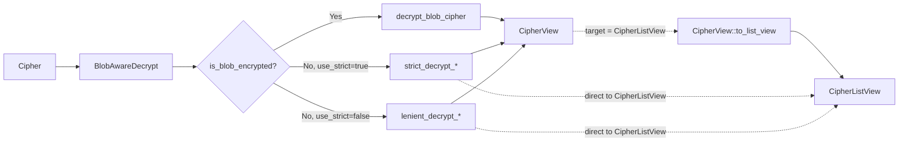

# Cipher Module

Data model, encryption, and decryption for vault items (logins, cards, identities, secure notes,
SSH keys).

## Type layers

| Type                                        | Role                           | Notes                                                                                                                                                                                                                             |
|---------------------------------------------|--------------------------------|-----------------------------------------------------------------------------------------------------------------------------------------------------------------------------------------------------------------------------------|
| `Cipher`                                    | Server / storage model         | Encrypted payload + metadata. Sensitive data is either per-field `EncString`s (legacy) or a single sealed `data` string (blob — see below).                                                                                       |
| `CipherView`                                | Fully decrypted DTO            | Returned to clients for display and editing.                                                                                                                                                                                      |
| `CipherListView`                            | Summary projection for list UI | Plaintext `name` + `subtitle` + type-specific preview + copyable hints. Smaller memory footprint than `CipherView` and omits highly sensitive fields (e.g. password, SSH private key) — one row per cipher times the whole vault. |
| `CipherCreateRequest` / `CipherEditRequest` | Public input DTOs              | Entry points into `CiphersClient::create` / `edit`.                                                                                                                                                                               |
| `CipherRequestModel`                        | Server wire format             | What `create` / `edit` send to the API.                                                                                                                                                                                           |

## Storage formats

A `Cipher` can be stored in one of two formats at rest, detected per-cipher:

- **Legacy (field-level)** — individual sensitive fields (`name`, `notes`, `login.username`, etc.)
  are each encrypted as separate `EncString`s.
- **Blob** — sensitive item content (name, notes, type-data, custom fields, password history)
  sealed into a single `Cipher.data` opaque string via a data envelope (CEK + wrapped key, see
  [`blob/`](./blob/)). Everything else — non-sensitive metadata (`favorite`, `folder_id`, dates)
  and separately-encrypted data (`attachments`, `local_data`) — stays alongside the blob on the
  `Cipher` struct.

Detection happens via `blob::is_blob_encrypted(&Cipher)`. Blob and legacy ciphers coexist during
rollout — a single `Vec<Cipher>` from the API routinely contains both.

## Decryption flow

All `CiphersClient::decrypt*` entry points funnel through a single wrapper type,
`BlobAwareDecrypt<Cipher>`, which auto-dispatches based on the cipher's format and a `use_strict`
flag inherited from the `strict_cipher_decryption` feature flag. This keeps the homogeneous-slice
requirement of `KeyStore::decrypt_list` satisfied while still handling mixed batches.

`Cipher` itself does **not** implement `Decryptable<…, CipherView>` — the only types that do are
`BlobAwareDecrypt<Cipher>` and `StrictDecrypt<Cipher>`. This is intentional: the legacy field-level
path silently produces an empty `CipherView` when handed a blob-shaped cipher (the encrypted
payload lives in `cipher.data`, which the legacy body ignores), so leaving a bare `Cipher` impl in
place would be a footgun. External crates that need to decrypt outside of `CiphersClient` (e.g.
`bitwarden-exporters`, `bitwarden-user-crypto-management` key rotation) construct a
`BlobAwareDecrypt` directly.

### Dispatch matrix

| Cipher format | `use_strict` (temporary) | `CipherView` path              | `CipherListView` path                              |
|---------------|--------------------------|--------------------------------|----------------------------------------------------|
| Blob          | (ignored)                | `decrypt_blob_cipher`          | `decrypt_blob_cipher` → `CipherView::to_list_view` |
| Legacy        | `true`                   | `strict_decrypt_cipher_view`   | `strict_decrypt_cipher_list_view`                  |
| Legacy        | `false`                  | `lenient_decrypt_cipher_view`  | `lenient_decrypt_cipher_list_view`                 |

Blob unseal is all-or-nothing, so the strict/lenient distinction only applies to the legacy branch.

## Encryption flow

Today, all encryption entry points (`CiphersClient::encrypt`, `encrypt_list`,
`encrypt_cipher_for_rotation`, and the `create` / `edit` request paths) go through the **legacy
field-level path** via the `CompositeEncryptable` impls on `CipherView`, `CipherCreateRequestInternal`,
and `CipherEditRequestInternal`.

Blob-path encryption dispatch is tracked in [PM-32695](https://bitwarden.atlassian.net/browse/PM-32695).

## Wrapper types

- **`BlobAwareDecrypt<T> { inner, use_strict }`** — auto-dispatcher at all decrypt call sites.
  Blob-ness is a property of the ciphertext, and strict/lenient only apply to the
  legacy branch, so the single wrapper handles all three paths.
- **`StrictDecrypt<T>(T)`** — transitional variant where field decryption errors propagate instead
  of silently nulling out affected fields. Gated behind `PM-34500-strict_cipher_decryption` and
  will eventually replace the default lenient `Decryptable` impls (tracked in PM-34531). Composed
  inside `BlobAwareDecrypt` via the `use_strict` flag.

## Submodules

- [`blob/`](./blob/) — blob sealing / unsealing, versioned blob format (currently `CipherBlobV1`),
  view ↔ blob conversions, and test vectors pinning the wire format.
- `cipher_client/` — `CiphersClient` and its `create`, `edit`, `delete`, `restore`, `share`, and
  attachment sub-clients.
- `cipher_permissions`, `cipher_view_type`, `field`, `linked_id`, `local_data` — supporting types.
- `attachment`, `attachment_client` — attachments (always encrypted outside the blob / field-level
  payload).
- Per-type modules: `login`, `card`, `identity`, `secure_note`, `ssh_key`.
